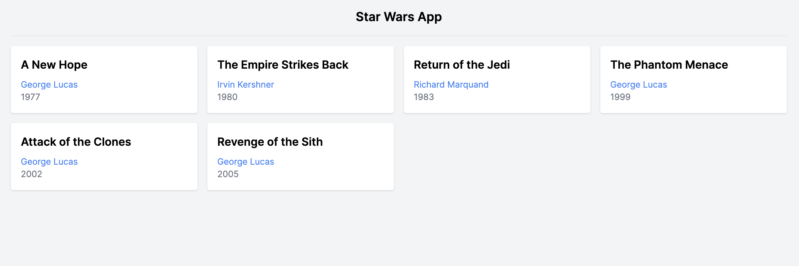
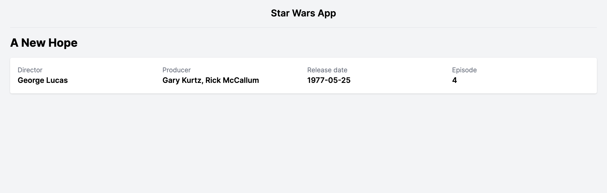
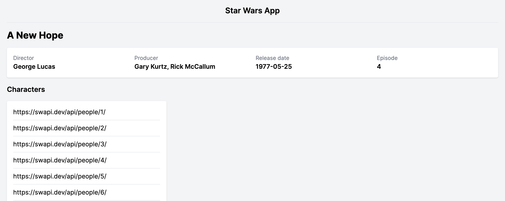
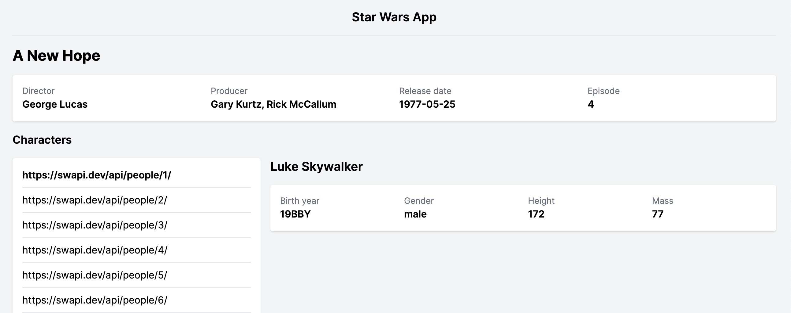
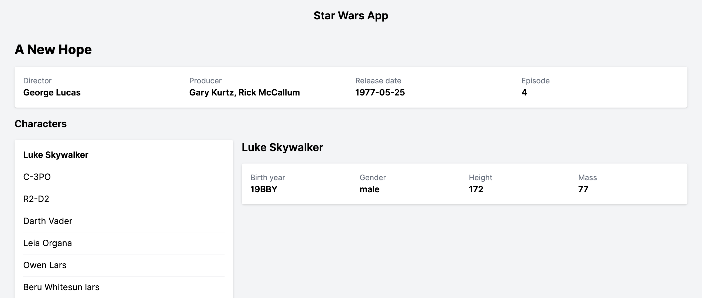

# 🌟 Star Wars API

En este repositorio utilizarás _Vue Router_ para construir una SPA con rutas separadas.
¡Que la fuerza te acompañe!

## Objetivos

- Usar Vue Router para separar partes lógicas y darles una estructura de rutas.
- Utilizar los componentes `<RouterView>` y `<RouterLink>` para utilizar el router.
- Usar el router programáticamente
- Generar páginas con rutas y sub-rutas
- Utilizar el _lifecycle hook_ `mounted`.
- Utilizar `watchers` para cargar nuevos datos en una misma vista.
- Utilizar _URL params_ y _query params_.
- Utilizar _axios_ como alternativa a _fetch_.
- Utilizar `Promise.all()` para trabajar con listas de promesas.

## Configuración

- Ejecuta `npm install` para instalar los paquetes (packages).
- Ejecuta `npm run dev` para ejecutar el servidor de desarrollo.

## Requisitos básicos

### 0. Estudia la estructura de archivos

- Fíjate en `router.js`, donde definimos las rutas de la aplicación, y cómo cada una de ellas tiene un componente asociado. Mira cómo se cargan en el archivo `main.js`.
- Los componentes principales (componentes "de página") van dentro de la carpeta `views`.
- Fíjate en cómo el componente `<App />` delega qué componente se mostrará a través del componente `<RouterView />`.

### 1. Crea una homepage

- Debe mostrar una lista de películas al cargar la página `<Home />`.
 - Cargaremos los datos de [The Star Wars API](https://swapi.dev/). Pasa 10 minutos leyendo la documentación para entender cómo funcionan los distintos _endpoints_.
 - Deberás leer sobre [lifecycle hooks](https://vuejs.org/guide/essentials/lifecycle.html) para utilizar el _lifecycle hook_ `mounted` y cargar los datos cuando la página se cargue.
 - Utiliza `fetch` o [axios](https://github.com/axios/axios) para cargar los datos en el método `getFilms`. Deberás llamar `getFilms` en el método `mounted`. Los datos los cargaremos del _endpoint_ `/films/`.
 - Añade un _state_ de _loading_ para cuando los datos se están cargando.
 - Añade estilos a la página y dale el diseño que más te guste. Puedes elegir qué datos muestras para cada película.

### 2. Crea la página de película y enlázala a la lista

- Cada película debe tener un enlace a su página.
 - Crea un nuevo componente `Film`, dentro de `views`, para mostrar la información de la película.
 - Crea una nueva ruta en el archivo `router.js`. Tienes que elegir un nombre por la ruta y asociar el componente que acabas de crear.
 - Necesitarás un _param_ en esta ruta para identificar la película que se mostrará.
 - Enlaza la ruta a la lista de películas de la _home_ mediante `<RouterLink>`.
 - El método `getId()` te permite obtener el ID de una URL. Puedes utilizarlo para generar tus links correctamente.

### 3. Carga la información de la película

- Tienes que mostrar la información de la película en la página de la película.
 - En el componente `Film`, carga los datos de la película de la API, como has hecho en el componente `Home`. Crea los métodos, `data` y _lifecycle hooks_ que necesites.
 - Muestra los datos en la página.
 - Añade un _state_ de _loading_ para cuando los datos se están cargando.
 - Añade estilos a la página y dale el diseño que más te guste.

### 4. Muestra la lista de personajes en la página de la película

Como, de momento, no tenemos los nombres de las películas, puedes poner sólo el enlace, como si fuera el nombre.

### 5. Crea la sub-página de personaje

- Crea una nueva [nested route](https://router.vuejs.org/guide/essentials/nested-routes.html) en el archivo `router.js` como sub-ruta de "film" para mostrar un personaje.
 - Define los parámetros que necesites en esta nueva ruta para representar el ID del personaje.
 - Crea un nuevo componente `<Character />` que muestre la información del personaje, extraída de la API.
 - Enlaza cada uno de los nombres de personaje con la nueva sub-ruta, mediante `<RouterLink />`.
 - Para que se muestre la sub-ruta dentro de la ruta principal, deberás utilizar el componente `<RouterView />` dentro del componente `<Film />`.
 - Llegado a este punto, si seleccionas a un personaje, y después seleccionas a otro, la información no se actualizará. Tendrás que leer sobre [watchers](https://vuejs.org/guide/essentials/watchers.html) para recargar los datos necesarios cuando queramos mostrar un personaje distinto.

### 6. Sustituye la lista de URLs por los nombres de los personajes

- Puedes cargar los datos de cada personaje de la API, simultáneamente, con [Promise.all()](https://developer.mozilla.org/en-US/docs/Web/JavaScript/Reference/Global_Objects/Promise/all ). Lee el artículo para entender cómo lanzar varias `Promise` de repente y esperar a que todas se resuelvan.
- Crea un nuevo _state_ `characters` en el componente `<Film />`.
- La función donde cargas los datos principales de la película, deberá cargar, **después**, los datos de cada personaje, y guardarlos en el nuevo _state_ que has creado.
- Pista: puedes utilizar una combinación de `Promise.all()`, `map` y `axios` para cargar esta información.
- Sustituye las URLs por los nombres de cada personaje en tu template.

### 7. OPCIONAL. Mejora todo lo que puedas de la app.

- Dale un estilo visual mejorado.
- Añade más secciones a la página de la película.
- Añade otras páginas (planetas, vehículos...) y enlacelas a la página de la película o entre ellas.
- Añade una página de personajes.
- Añade un buscador de personajes.
- Optimiza tu código reutilizando componentes y hazlo más compacto.

## Recursos

- [Vue Router](https://router.vuejs.org/introduction.html)
- [Vue Documentation](https://vuejs.org/guide/introduction.html)
- [Vue lifecycle hooks](https://vuejs.org/guide/essentials/lifecycle.html)
- [Vue watchers](https://vuejs.org/guide/essentials/watchers.html)
- [Axios](https://github.com/axios/axios)
- [The Star Wars API](https://swapi.dev/)
- [Promise.all()](https://developer.mozilla.org/en-US/docs/Web/JavaScript/Reference/Global_Objects/Promise/all)

## Notas

_Este es un proyecto de estudiante creado en [CodeOp](http://CodeOp.tech), en el bootcamp de Front End Development en Barcelona._
